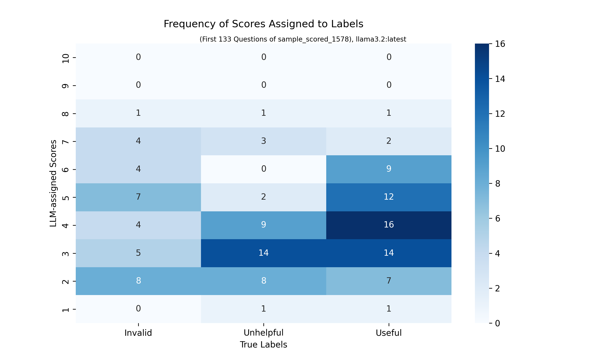

## Sorting Questions by Rank

**All code regarding ranking of questions is contained in the `opitz_models_2` directory.**
The system takes an argument and a list of questions. All questions are assigned a usefulness score which is used to sort the questions from useful (first) to unhelpful/invalid (last).

  

# Libraries

`pip install json-repair`

  

#### Mock Example
```python
from QuestionScorer import QuestionScorer

# Same LLM is used for all Agents
LLM = "llama3.2:latest" # "llama3.2:3b-instruct-q8_0"

# Define single argument as string
argument = "CLINTON: \"The central question in this election is really what kind of country we want to be and what kind of future we 'll build together\nToday is my granddaughter 's second birthday\nI think about this a lot\nwe have to build an economy that works for everyone , not just those at the top\nwe need new jobs , good jobs , with rising incomes\nI want us to invest in you\nI want us to invest in your future\njobs in infrastructure , in advanced manufacturing , innovation and technology , clean , renewable energy , and small business\nmost of the new jobs will come from small business\nWe also have to make the economy fairer\nThat starts with raising the national minimum wage and also guarantee , finally , equal pay for women 's work\nI also want to see more companies do profit-sharing\""

# Define list of questions as list of strings
questions = [
    "How would you address potential criticisms and counterarguments to these policies, and what would be your response to opposing views and interests?", # Invalid
    "Are there other relevant goals that conflict with investing in you?", # Unhelpful
    "What is the proposed plan for making the economy fairer, beyond raising the national minimum wage and guaranteeing equal pay for women's work?", # Useful
    "What specific policies would you implement to achieve an economy that works for everyone, and how would you ensure their effectiveness?", # Invalid
    "Could Clinton investing in you have consequences that we should take into account? Is it practically possible?", # Useful
    "Could creating jobs in infrastructure, in advanced manufacturing, innovation and technology, clean, renewable energy, and small businesses have consequences that we should take into account? Is it practically possible?" # Useful
]

# Instantiate Scorer
scorer = QuestionScorer(LLM)

# Sort questions, helpful first, unhelpful/invalid last
sorted_questions = scorer.sort_questions(argument, questions)
```

#### Best Run
